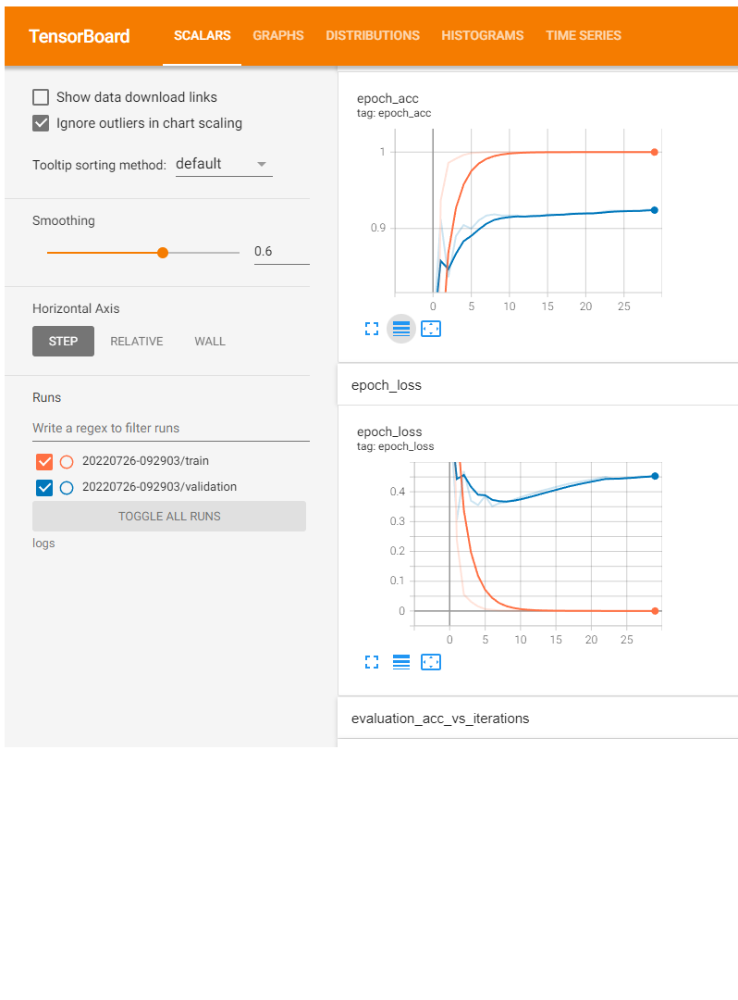

# :detective: Natural Language Processing for Article Multiclass Classification

Capable of categorising articles about Sport, Technology, Business, Entertainment, and Politics.

## Description

A Data Science project using Deep Learning via TensorFlow library for classification problem.

## Getting Started

### Dependencies

* Matplotlib version 3.5*
* Numpy version 1.22*
* Pandas version 1.4*
* Python version 3.8*
* Scikit-learn version 1.0*
* Scipy version 1.7*
* Seaborn 0.11*
* TensorFlow version 2.3*
* TensorBoard 2.9*

### Datasets

* Datasets : [PyCon-Canada-2019-NLP](https://raw.githubusercontent.com/susanli2016/PyCon-Canada-2019-NLP-Tutorial/master/bbc-text.csv)

### Executing program

* Code can be clone and run directly using any IDE with the environment listed
* The script was divided into several categories such as:
  1. Data Loading
  2. Data Inspection & Visualization
  3. Data Cleaning
  4. Feature Selection
  5. Data Preprocessing
  6. Model Development
  7. Model Analysis

### Results

* Model Architecture 

* TensorBoard

* The classification results are as follows:

* Confusion Matrix:

### Future Works

* Expect NLTK libraries usage in the future :v:

## Acknowledgments

I would like to express my gratitude to [Susan Li](https://github.com/susanli2016) for providing the datasets for me to test my Deep Learning understanding on NLP problems.

PEACE OUT :love_you_gesture:

